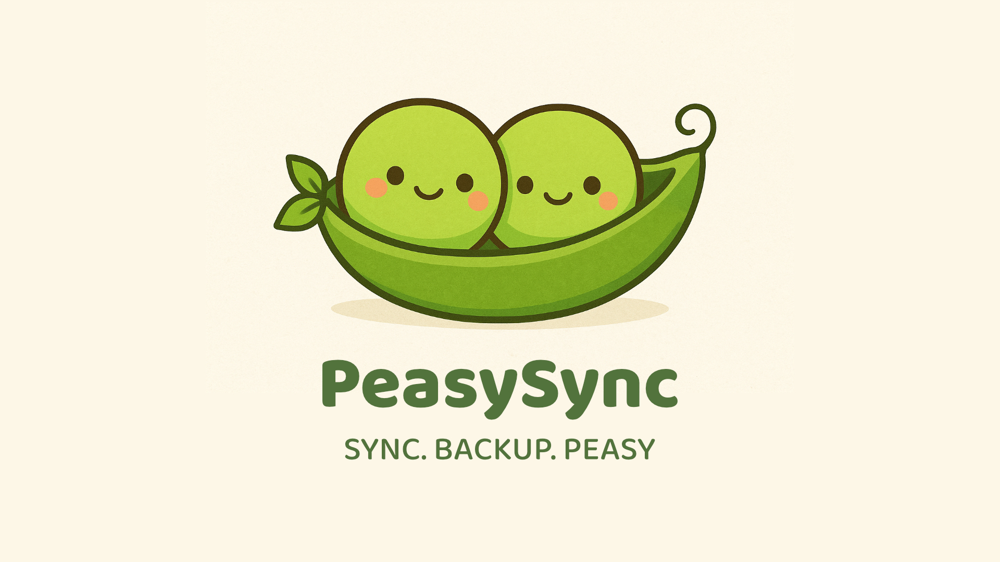

# PeasySync

A simple Chrome/Brave extension to back up and restore your bookmarks using Google Drive.

## Setup
1. Clone this repo and rename `manifest.json.example` → `manifest.json` 
2. Load the extension:
    - Open `brave://extensions` → enable Developer mode → Load unpacked → select this folder.
    - Open Settings → Extenstions → Allow Google login for extension 
3. Go to [Google Cloud Console](https://console.cloud.google.com/). 
4. Enable the Google Drive API. 
5. Create OAuth credentials (Web application). 
6. Add Authorised redirect URIs → `https://EXTENSION-ID.chromiumapp.org`
7. Add Data Access Scopes → `.../auth/drive.file` and `.../auth/drive.metadata.readonly`
8. Replace the `oauth2.client_id` in `manifest.json` file with your client ID. 
9. Click the extension icon → Backup or Restore bookmarks.

## Notes
- Bookmarks are stored in a file called `bookmarks-peasy-sync.json` inside a `Backup` folder on your Google Drive.
- Backup overwrites this file, Restore loads from it.
